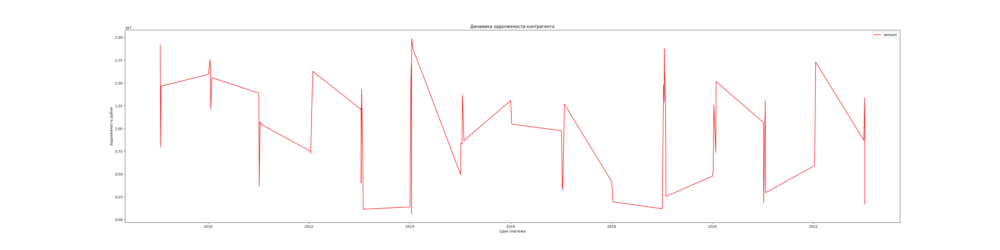

# Readme ETL aeroflot project v0.1


This program fills in the database of counterparties with the ability to view the dynamics
debts for unique counterparties.

In solving this problem, the branches of the main companies were classified as unique counterparties.

## Afterwords

Since the main Excel file contains a large number of spelling errors, it was best to solve
the task using machine learning. Or using api to search 
equal ИНН by names. 

## Usage

Setup requirements first
```python
pip3 install -r requirements.txt
```

After this you need setup your pg connections in main.py and create 2 tables

```python
connection = psycopg2.connect(database="bdname", user="username",
                              password="password", host="localhost", port="5432")
```
Create uniq_name table
```postgresql
CREATE TABLE public.uniq_name
(
    uniq_names character varying[] COLLATE pg_catalog."default",
    uniq_id uuid NOT NULL,
    CONSTRAINT uniq_name_pkey PRIMARY KEY (uniq_id)
)
```
Create Main_excel table
```postgresql
CREATE TABLE public."Main_excel"
(
    amount bigint,
    id integer NOT NULL DEFAULT nextval('"Main_excel_id_seq"'::regclass),
    name character varying COLLATE pg_catalog."default",
    payday date,
    doc_number character varying COLLATE pg_catalog."default",
    uniq_id uuid,
    CONSTRAINT "Main_excel_pkey" PRIMARY KEY (id)
)
```

Then select the one sheet you need in main.py

```python
risks = pd.read_excel('risks.xlsx', skiprows=[0], sheet_name="1q 2021")
```

Then run main.py

### Dynamic graph usage
Again edit your connection
```python
connection = psycopg2.connect(database="bdname", user="username",
                              password="password", host="localhost", port="5432")
```
After this enter your required uniq_id in sql command
```python
back = pd.read_sql('select * from "Main_excel" where uniq_id=\'cdd4e6ef-99a9-4892-98e1-4b187f93ff29\'', con=connection)
```

###GRAPH for ВТБ БАНК
